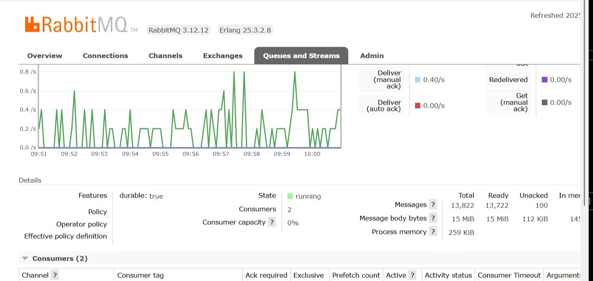

# WEB HOOK ACCESOS

##  Descripción Simple del Proyecto
**Sistema de Validación de Accesos con Mensajería Asíncrona**
Este sistema está dividido en dos servicios principales:

- **WAccesos:** Valida enlaces y encola un objeto JSON con datos en RabbitMQ. Este mensaje representa una solicitud de validación de acceso.

- **reciveAccesos:** Escucha mensajes de la cola RabbitMQ, los procesa y realiza validaciones como parte del sistema CRM SUMA, chequeando datos como credenciales o accesos.

Además, este sistema se comunica mediante colas (RabbitMQ usando EasyNetQ) y utiliza servicios de Windows para ejecutarse automáticamente, integrando logs con Serilog y exponiendo APIs documentadas con Swagger.

## Paquetes a utilizar

* Dapper (2.1.66): Micro ORM (Object-Relational Mapper) rápido y liviano para .NET. Permite mapear datos de SQL a objetos C# de forma eficiente. Usado probablemente para consultar la base de datos del CRM.

* EasyNetQ (7.8.0): Cliente de alto nivel para RabbitMQ en .NET. Simplifica la publicación y suscripción de mensajes. Es el principal puente entre WAccesos y reciveAccesos.

* Microsoft.AspNetCore.Hosting (2.3.0): Permite alojar una aplicación web ASP.NET Core. Maneja el ciclo de vida del servidor web.

* Microsoft.Extensions.Hosting.WindowsServices (9.0.6): Permite que una aplicación ASP.NET Core se ejecute como un servicio de Windows. Útil para reciveAccesos si corre como background service.

* Microsoft.Extensions.Http.Polly (9.0.6): Integra la biblioteca Polly para manejar resiliencia (reintentos, circuit breakers) en llamadas HTTP.

* Newtonsoft.Json (13.0.3): Biblioteca popular para serializar y deserializar JSON. Útil para manipular los objetos que se envían/reciben por RabbitMQ.

* Serilog.AspNetCore (9.0.0): Permite integrar el sistema de logs Serilog en aplicaciones ASP.NET Core. Facilita registrar eventos y errores.

* Serilog.Sinks.Console (6.0.0): Salida de logs de Serilog hacia la consola. Útil en modo desarrollo.

*Serilog.Sinks.File (7.0.0): Guarda los logs de Serilog en archivos locales. Útil para auditorías o revisión de errores.
Swashbuckle.AspNetCore (9.0.1)	Biblioteca para generar documentación Swagger/OpenAPI automáticamente desde tu API ASP.NET Core.

* System.Data.SqlClient (4.9.0): Cliente para conectarse a bases de datos SQL Server. Usado para consultar o actualizar registros relacionados con accesos.

* System.Text.Json (9.0.6):	Alternativa más rápida y nativa de .NET para manejar JSON. Puede usarse junto con o en lugar de Newtonsoft.Json.

## Flujo del Proyecto

El flujo del proyecto sigue estos pasos:

1. Encolado de Mensajes:

El servicio WAccesos valida los enlaces y publica un mensaje en una cola de RabbitMQ (AccesosResultadosCRM) con un conjunto de datos en formato JSON.

2. Suscripción y Procesamiento de Mensajes:

El servicio reciveAccesos se suscribe a la cola de RabbitMQ para escuchar los mensajes.

Cuando un mensaje es recibido, se procesa en paralelo utilizando un semáforo para controlar la concurrencia y evitar la sobrecarga del sistema.

3. Validaciones:

Se validan los datos del mensaje, asegurando que todos los campos necesarios estén presentes. Si algún campo falta o hay un error en los datos, el mensaje se registra como fallido.

4. Interacción con Webhook y Base de Datos:

Si los datos son válidos, el servicio interactúa con un Webhook para realizar el proceso de notificación y consultar datos adicionales necesarios (como números de celular y ID de usuario).

5. Notificación:

Una vez que todos los datos han sido validados y procesados, se envía una notificación al sistema correspondiente.

6. Manejo de Errores:

Si ocurre un error durante cualquiera de los pasos (validación, inserción en el webhook, obtención de datos), se registra el error y el proceso se detiene para ese mensaje, asegurando que los errores sean auditables.

## 📱 Pantalla del Servidor Rabbit local publicado

## TOKEN NECESARIO PARA PODER USAR ESTE WEB HOOK
x-api-key: 17aqk3-h19f-jxa0-cb5c-bkdcm0q78sss

## END POINT
api/Accesos

## ENLACE LOCAL
https://localhost:44316/api/Accesos

## JSON Requerido

{
  "checksum": "b3072c609371aa236ccde4a22d0427067eb78cd6",
  "success": true,
  "isEntrance": true,
  "date": "2025-06-16T16:10:15.5646408-06:00",
  "resource": {
    "id": "019581ae-4718-7a29-b2b8-5d719553579f",
    "name": "TEST_PROGRAMA_SOCIAL_PRUEBA_10/03/2025",
    "externalId": "7299",
    "tenantId": "d22803a7-7c74-4d22-857d-ccc45ae62dce",
    "accessPoints": [],
    "credentials": []
  },
  "accessPoint": {
    "id": "0195ce8f-806a-7da3-ab44-5d95d39a5c96",
    "operation": 2,
    "mode": 2,
    "resourceId": "019683ce-63ba-783d-92aa-8a358a1190a1",
    "active": false,
    "timezone": "America/Mexico_City",
    "resource": null,
    "accesses": []
  },
  "credential": {
    "id": "160aacea-2f43-46be-ab59-da7b5a59054f",
    "beneficiaryId": "fbba8509-726e-4006-8841-b72b5fc5c134",
    "beneficiary": {
      "id": "ff2d5ba0-31e7-4794-b864-d01704eee92c",
      "name": "ROGER COLORADO CANTO",
      "externalId": "5599672",
      "credentials": []
    },
    "resources": [],
    "accesses": []
  }
}

## Respuesta WebHook

Se devuelve un JSON como respuesta. 
{
    "success": true,
    "mensaje": "Datos Encolados",
    "hash": "decc34a4086d43a69f1bbed60f922599"
 }

 1. **success:** true/false. 
2. **mensaje:** Mensaje devuelto dependiendo del error ocurrido o si la información fue encolada correctamente se mostrará el siguiente mensaj“Datos Encolados”.
3. **hash:** UUID (Identificador Único Universal) para verificar si los datos fueron insertados correctamente o hubo algún error inconveniente en la bitácora.

## COMANDOS PARA CONVERTIR UN APLICATIVO EN UN SERVICIO DE WINDOWS

1. Para crear por primera vez el servicio de Windows, se usa el siguiente comando, tomando en cuenta la dirección del compilado del proyecto en un archivo .exe

- sc config ReciveAccesos binPath= "C:\Compilados\ReciveAccesos\ReciveAccesos.exe --service"

2. Para inicializarlo es con el siguiente comando:

- net start ReciveAccesos

2. Para detener el servicio de Windows es el siguiente:

- net stop ReciveAccesos
